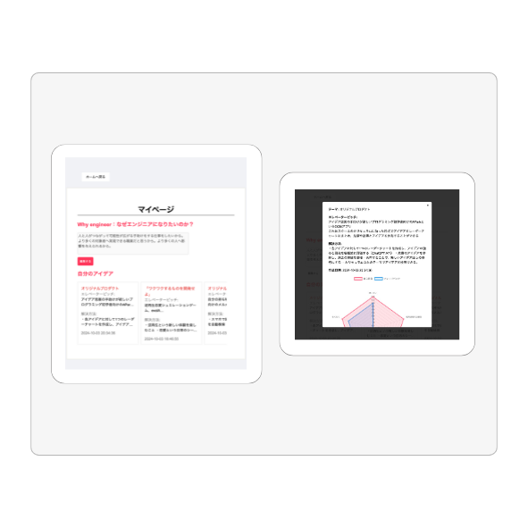

# アイデア補助輪アプリ APark(エーパーク)

## 概要
プログラミング初学者であるAPPRENTICE生を対象とした、 **"良いアイデア"** を整理できるアプリです。 
このアプリを使えば、アイデア出しの補助輪に乗ることができ、ドラフトという名の旅に気持ち良く出発することができます。

### “良いアイデア”とは？
* 自分が楽しんで作成できる 
* エンジニアになりたい理由とのストーリーがあるもの 
* 目新しい 
* 具体的なプロダクトイメージができている 
* 実現可能なもの 
* 競合と被らない 

リンク：[APark (エーパーク)](https://apark.click/)

## 解説記事

## 使用技術
### フロントエンド
* HTML/CSS
* Javascript
### バックエンド
* PHP 8.3.10
* Laravel Framework 11.11.0
### データベース
* mysql  Ver 8.0.39
### ライブラリ
* jQuery
* Slick Carousel
* Chart.js
### インフラ(AWS)
* EC2
* RDS
* ALB
* Route53
* ACM 他...
### バージョン管理
* Git/GitHub
### CI/CD
* PHP Code Sniffer
* PHP Stan
### その他
* OpenAI API

## ER図

## システム構成図

## 機能一覧

| トップページ | アカウント登録、ログインページ |
| --- | --- |
|  |  |
| ・アプリの説明 ・アイデアの作成方法 | ・登録したユーザーIDとパスワードのみでログインできます ・ユーザー登録はIDをパスワードの他に期生の設定を行います |

| アイデア一覧ページ | マイページ |
| --- | --- |
|||
|・投稿されたアイデアを閲覧できます ・セレクトボックスの値を変えると閲覧したいアイデアをテーマで絞ることができます ・マイページ、下書き、アイデアの新規作成の3つに遷移できます| ・エンジニアになりたい理由(Why engineer)を入力し、レーダーチャートの精度を上げます ・自分が投稿したアイデアを見ることができます ・アイデアをクリックすると詳細がモーダルウィンドウに表示されます ・ここでアイデアを削除することもできます |

## アップデート予定
## リリースノート
**ver 1.0.0** 
2024年8月12日 APark リリース
