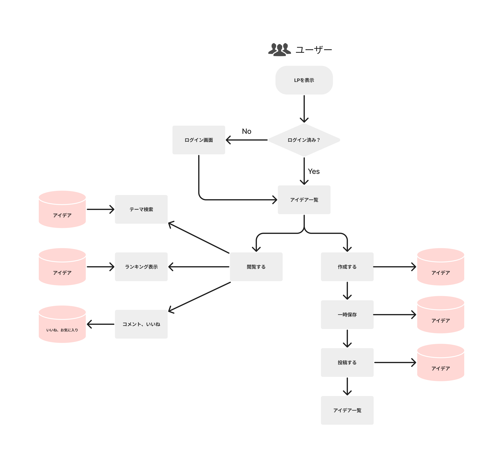
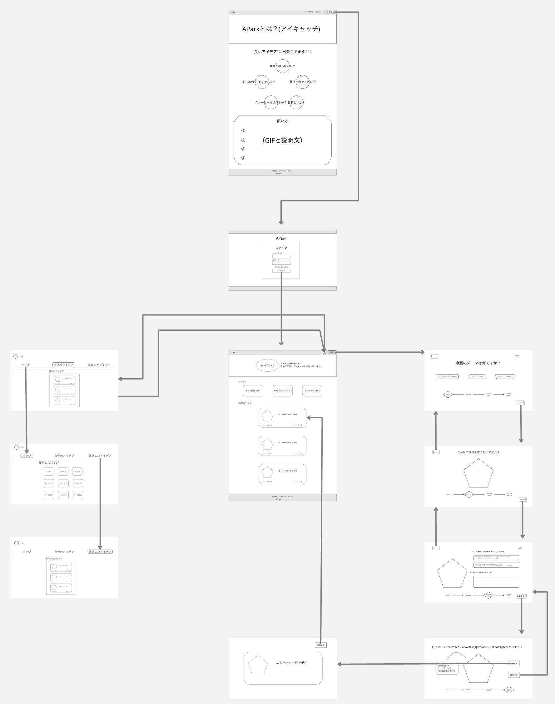
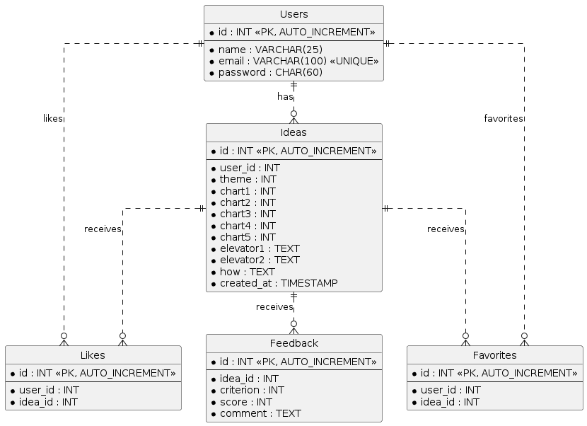
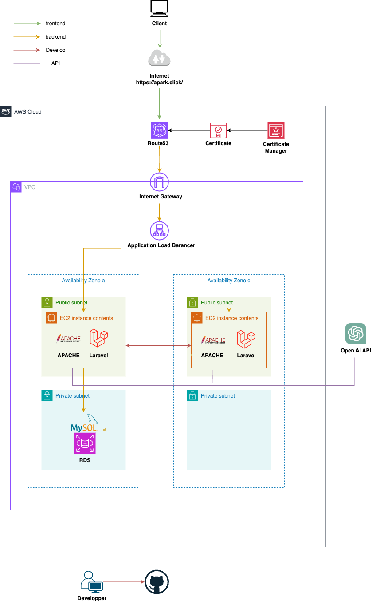

# 設計
## 業務フロー

## 画面遷移図/ワイヤーフレーム

## ER図

## テーブル定義書
### Usersテーブル
| カラム名        | 意味                  | データ型 | PK   | FK   | NOT NULL | AUTO_INCREMENT | 制約 |
| :-------------- | :-------------------- | :------- | :--- | :--- | :------- | :---- | :------ |
| id              | ユーザーID            | INT   | ◯   |      |    ◯    | ◯ |         |
| name            | ユーザー名            | VARCHAR(25)   |      |      | ◯  |       |         |
| email           | メールアドレス        | VARCHAR(100)   |      |      | ◯ |    |   UNIQUE      |
| password | パスワード  | CHAR(60)   |      |      | ◯       |       |         |

### Ideasテーブル
| カラム名        | 意味                  | データ型 | PK   | FK   | NOT NULL | AUTO_INCREMENT | 制約 |
| :-------------- | :-------------------- | :------- | :--- | :--- | :------- | :---- | :------ |
| id              | アイデアID            | INT   | ◯   |      |    ◯    | ◯ |         |
| user_id            | ユーザーID            | INT   |      |      | ◯  |       |         |
| theme           | テーマ        | INT   |      |      | ◯ |    |     |
| chart1 | 競合と被らないか  | INT   |      |      | ◯       |       |         |
| chart2 | 使用技術の正しさ  | INT   |      |      | ◯       |       |         |
| chart3 | 目新しさ  | INT   |      |      | ◯       |       |         |
| chart4 | ストーリー性  | INT   |      |      | ◯       |       |         |
| chart5 | わくわくするか  | INT   |      |      | ◯       |       |         |
| elevator1 | エレベーターピッチ１  | TEXT   |      |      | ◯       |       |         |
| elevator2 | エレベーターピッチ2  | TEXT   |      |      | ◯       |       |         |
| how| どのように解決するか  | TEXT   |      |      | ◯       |       |         |
| created_at | 作成日  | TIMESTAMP   |      |      | ◯       |       |         |

### Likesテーブル
| カラム名        | 意味                  | データ型 | PK   | FK   | NOT NULL | AUTO_INCREMENT | 制約 |
| :-------------- | :-------------------- | :------- | :--- | :--- | :------- | :---- | :------ |
| id           | ライクID            | INT   | ◯   |      |    ◯    | ◯ |         |
| user_id      | ユーザーID            | INT  |      |      | ◯  |       |         |
| idea_id      | アイデアID       | INT |      |   | ◯ |    |     |

### Favoritesテーブル
| カラム名        | 意味                  | データ型 | PK   | FK   | NOT NULL | AUTO_INCREMENT | 制約 |
| :-------------- | :-------------------- | :------- | :--- | :--- | :------- | :---- | :------ |
| id           | ライクID            | INT   | ◯   |      |    ◯    | ◯ |         |
| user_id      | ユーザーID            | INT  |      |      | ◯  |       |         |
| idea_id      | アイデアID       | INT |      |      | ◯ |    |     |

### Feedbackテーブル
| カラム名        | 意味                  | データ型 | PK   | FK   | NOT NULL | AUTO_INCREMENT | 制約 |
| :-------------- | :-------------------- | :------- | :--- | :--- | :------- | :---- | :------ |
| id           | フィードバックID            | INT   | ◯   |      |    ◯    | ◯ |         |
| idea_id      | アイデアID            | INT  |      |      | ◯  |       |         |
| criterion     | 評価項目    | INT |      |      | ◯ |    |     |
| score     | 評価点数  | INT |      |      | ◯ |    |     |
| comment     | FBコメント   | TEXT |      |      | ◯ |    |     |

### システム構成図

