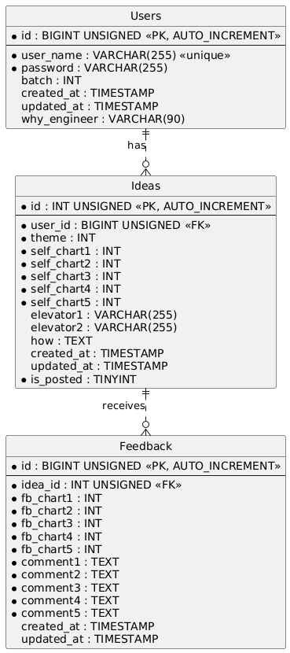

# 設計
## 業務フロー

## 画面遷移図/ワイヤーフレーム

## ER図

## テーブル定義書
### Usersテーブル
| カラム名        | 意味                  | データ型 | PK   | FK   | NOT NULL | AUTO_INCREMENT | 制約 |
| :-------------- | :-------------------- | :------- | :--- | :--- | :------- | :---- | :------ |
| id              | ユーザーID            | BIGINT   | ◯   |      |    ◯    | ◯ |         |
| user_name            | ユーザー名            | VARCHAR(255)   |      |      | ◯  |       |    UNIQUE     |     |
| password | パスワード  | VARCHAR(255)   |      |      | ◯       |       |         |
| batch | 何期生か  | INT   |      |      | ◯       |       |         |
| created_at | 作成日時  | TIMESTAMP   |      |      | ◯       |       |         |
| updated_at | 更新日時  | TIMESTAMP   |      |      | ◯       |       |         |
| why_engineer | エンジニア志望理由  | VARCHAR(90)   |      |      |        |       |         |

### Ideasテーブル
| カラム名        | 意味                  | データ型 | PK   | FK   | NOT NULL | AUTO_INCREMENT | 制約 |
| :-------------- | :-------------------- | :------- | :--- | :--- | :------- | :---- | :------ |
| id              | アイデアID            | BIGINT   | ◯   |      |    ◯    | ◯ |         |
| user_id            | ユーザーID            | BIGINT   |      |   ◯   | ◯  |       |         |
| theme           | テーマ        | INT   |      |      | ◯ |    |     |
| self_chart1 | セルフチャート1  | INT   |      |      | ◯       |       |         |
| self_chart2 | セルフチャート2  | INT   |      |      | ◯       |       |         |
| self_chart3 | セルフチャート3  | INT   |      |      | ◯       |       |         |
| self_chart4 | セルフチャート4  | INT   |      |      | ◯       |       |         |
| self_chart5 | セルフチャート5  | INT   |      |      | ◯       |       |         |
| elevator1 | エレベーターピッチ１  | VARCHAR(255)   |      |      |        |       |         |
| elevator2 | エレベーターピッチ2  | VARCHAR(255)   |      |      |        |       |         |
| how| どのように解決するか  | TEXT   |      |      |        |       |         |
| created_at | 作成日時  | TIMESTAMP   |      |      | ◯       |       |         |
| updated_at | 更新日時  | TIMESTAMP   |      |      | ◯       |       |         |
| is_posted | 投稿状態  | TINYINT   |      |      | ◯       |       |         |

### Feedbackテーブル
| カラム名        | 意味                  | データ型 | PK   | FK   | NOT NULL | AUTO_INCREMENT | 制約 |
| :-------------- | :-------------------- | :------- | :--- | :--- | :------- | :---- | :------ |
| id           | フィードバックID            | BIGINT   | ◯   |      |    ◯    | ◯ |         |
| idea_id      | アイデアID            | BIGINT  |      |  ◯    | ◯  |       |         |
| fb_chart1 | フィードバックチャート1  | INT   |      |      | ◯       |       |         |
| fb_chart2 | フィードバックチャート2  | INT   |      |      | ◯       |       |         |
| fb_chart3 | フィードバックチャート3  | INT   |      |      | ◯       |       |         |
| fb_chart4 | フィードバックチャート4  | INT   |      |      | ◯       |       |         |
| fb_chart5 | フィードバックチャート5  | INT   |      |      | ◯       |       |         |
| comment1 | フィードバックコメント1  | TEXT   |      |      | ◯       |       |         |
| comment2 | フィードバックコメント2  | TEXT   |      |      | ◯       |       |         |
| comment3 | フィードバックコメント3  | TEXT   |      |      | ◯       |       |         |
| comment4 | フィードバックコメント4  | TEXT   |      |      | ◯       |       |         |
| comment5 | フィードバックコメント5  | TEXT   |      |      | ◯       |       |         |
| created_at | 作成日時  | TIMESTAMP   |      |      | ◯       |       |         |
| updated_at | 更新日時  | TIMESTAMP   |      |      | ◯       |       |         |

### システム構成図

